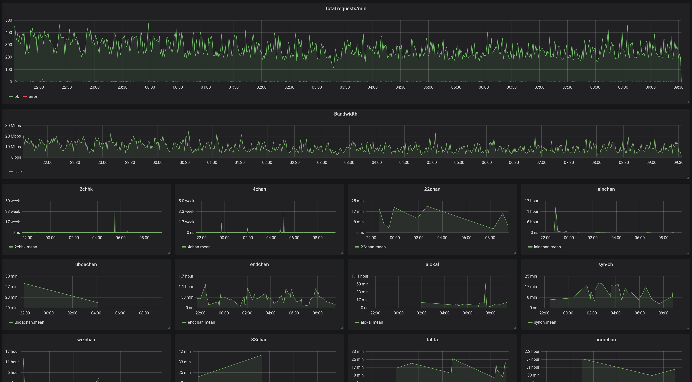

### chan_feed

Daemon that fetches posts from compatible *chan
image boards and publishes serialised JSON to RabbitMQ
 for real-time ingest.
 
Compatible image boards: 4chan, lainchan, uboachan,
22chan, wizchan, 1chan, 2ch.hk.

Can optionally push monitoring data to InfluxDB. Below is an
example of Grafana being used to display it.

